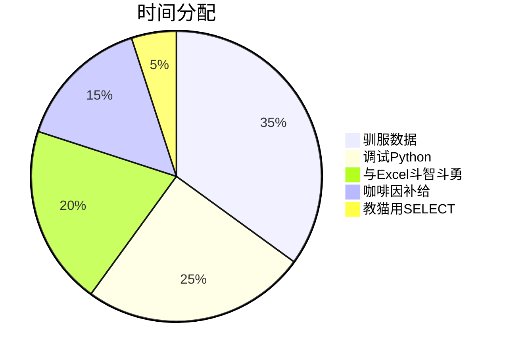

# 🦉 Chen Meng | 数据炼金术师

> *"将Excel变成时间转换器，Python化作流浪猫救援计划，  
> 用数据讲故事的金融转行者 | 偶尔在德语里迷路的中国分析师"*

---

## 🎩 **我的魔法工具箱**
```python
def my_magic():
    return {
        "编程语言": ["Python(Pandas)", "SQL", "VBA", "DAX"],
        "分析工具": ["Excel", "Power BI", "Jupyter Notebook"],
        "超能力": ["预算预测↑30%", "投诉分析↓20%", "用数据救助流浪动物"]
    }
```


---

## 🏆 **高光时刻**
```sql
SELECT * FROM chen_meng_achievements 
WHERE awesome_level > 9000;
-- 结果1: "用Python NLP模型减少20%客户投诉 😼"
-- 结果2: "Excel动态模型提升预算效率30% 💸"
-- 结果3: "证明救助流浪狗比买新iPhone更经济 📊"
```

---

## 📊 **数据可视化作品**
[](https://example.com)  
[](https://example.com)

---

## ⏳ **典型一天**


---

## 📮 **找到我**
```diff
# 安全联系方式（无微信版）
! 📧 邮箱: mengmiaosha91@gmail.com  
! 💼 LinkedIn: [点击联系](
https://linkedin.com/in/chen-meng-023712316)
! 🌐 个人网站: [建设中...](
https://example.com)  # 可选替换
```

<details>
<summary>🎁 点击查看隐藏彩蛋</summary>

```python
print("秘密技能解锁：")
easter_eggs = [
    "用Excel绘制像素画",
    "用VBA自动回复老板邮件",
    "用SQL分析猫咪饮食习惯"
]
for egg in easter_eggs:
    print(f"🔐 {egg}")
```
</details>


