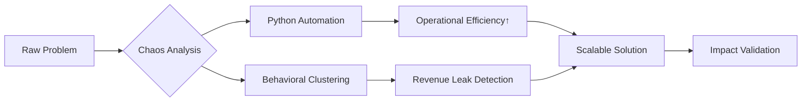

#  Chen Meng | Data Solutionist

> *"Taming data chaos with Python by day, optimizing cat economies with Excel by night

> Quadrilingual problem-solver (Python, Excel, English, and fluent in Cat)"*

## 🛠️ **My Solution Engineering Toolkit**

```python

def solution_engine():

return {

"Core Tech": ["Python(Pandas/Scikit)", "SQL", "Excel VBA", "Power BI"],

"Superpowers": [

"Translating vague problems → executable solutions",

"Auto-generating ROI reports with Python",

"Proving stray cat rescue > corporate ESG initiatives"

],

"Battle Tactics": [

"Monte Carlo simulations for market uncertainty",

"RFM+K-Means clustering for hidden revenue",

"Cross-cultural solution validation"

]

}

```

## 🚀 **Impact Highlights**

```sql

SELECT problem, solution, business_impact FROM career_achievements

WHERE innovation_score > 90;

-- > "Customer complaints → Python NLP → 25% reduction"

-- > "HNWI segment → Behavioral clustering → 200% growth"

-- > "Market gaps → RFM analysis → €300K opportunity"

-- > "German board game barriers → TischZeit → 3 revenue streams"

```

## 🔥 **Signature Solution Projects**

### 🧠 Complaint-to-Cash Conversion | Python NLP + Process Design

**Problem:** Recurring customer complaints draining retention at Generali

**My Solution:**

- Engineered complaint categorization system using TF-IDF + NLTK

- Automated response workflow saving 15hrs/week

- Co-designed policy simplification playbook

**Impact:**

📉 25% complaint reduction | 💰 15% retention lift | 🚀 40% faster resolution

[]()

### 👑 HNWI Growth Engine | Behavioral Clustering + Business Design

**Problem:** Stagnant premium client segment at Generali China

**My Solution:**

- Self-taught K-Means clustering to identify 3 high-potential segments

- Designed tiered insurance bundles + advisor incentive model

- Launched tax planning seminars (35% conversion)

**Impact:**

📈 HNWI share: 10% → 30% in 12 months | 💶 +40% NBV growth | 🏆 Balanced portfolio

[]()

### 🌍 TischZeit: Cross-Cultural Gaming Platform | Market Validation

**Problem:** Expats excluded from Germany's €400M board game market

**My Solution:**

- Mapped language/cultural barriers through 50+ user interviews

- Prototyped multilingual platform with publisher partnership model

- Validated 3 revenue streams (event fees, promotions, subscriptions)

**Key Features:**

🌐 Language-filtered discovery | 🎮 Professional GM ecosystem | 📍 Geo-targeted events

[]()

## 📊 **Data Alchemy Process**


```mermaid

graph LR

A[Raw Problem] --> B{Chaos Analysis}

B --> C[Python Automation]

B --> D[Behavioral Clustering]

C --> E[Operational Efficiency↑]

D --> F[Revenue Leak Detection]

E --> G[Scalable Solution]

F --> G

G --> H[Impact Validation]

```

## 🐾 **Feline-Approved Workflow**

```diff

# Solution Engineering Breakdown

+ Problem Sculpting ▰▰▰▰▰▰▰▰▰▰▰▰ 30% ("Is this a human or cat problem?")

+ Data Alchemy      ▰▰▰▰▰▰▰▰▰▰▰ 25% ("Pandas > actual pandas")

+ Stakeholder Magic ▰▰▰▰▰▰▰▰▰ 20% ("Translating meows to KPIs")

+ Impact Validation ▰▰▰▰▰▰▰ 15% ("Proving cats > consultants")

+ Cat Debugging     ▰▰▰▰▰ 10% ("Paws-on-keyboard testing")

```

## 📬 **Connect With a Solutionist**

```diff

! 💌 Professional: mengmiaosha91@gmail.com

! 💼 Strategy Talks: [LinkedIn](https://linkedin.com/in/chen-meng-023712316)

```

> **Note:** Slow responses = debugging cat economics models

<details>

<summary>😼 Click for Feline Economics Principles</summary>

```python

feline_economics = {

"Principle 1": "1 bug fix = 3 chin scratches ROI",

"Principle 2": "Code quality ∝ purring decibels",

"Principle 3": "Optimal debugging: stare at cat for 7.3s",

"Validation": "Data-proven: Cat food > consulting fees"

}

print("🐱 Feline-Approved Solution Framework:")

for k, v in feline_economics.items():

print(f"• {k}: {v}")

```

</details>


> *"I don't just analyze data - I weaponize it to solve business puzzles.

> Currently accepting challenges in: Data-driven growth • German market entry • Cat economics"*

`````
